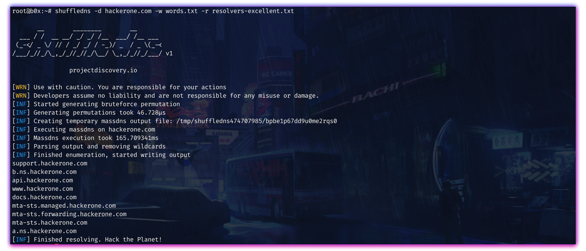

<h1 align="center">
  
  <br>
</h1>

<h4 align="center">Native high-throughput DNS bruteforce and resolve with wildcard handling</h4>

<p align="center">
<a href="https://goreportcard.com/report/github.com/projectdiscovery/shuffledns"></a>
<a href="https://github.com/projectdiscovery/shuffledns/issues"></a>
<a href="https://github.com/projectdiscovery/shuffledns/releases"></a>
<a href="https://twitter.com/pdiscoveryio"></a>
<a href="https://discord.gg/projectdiscovery"></a>
</p>

<p align="center">
  <a href="#features">Features</a> •
  <a href="#installation">Install</a> •
  <a href="#usage">Usage</a> •
  <a href="#running-shuffledns">Run</a> •
  <a href="#handling-wildcards">Wildcards</a> •
  <a href="#massdns-parity">massdns parity</a> •
  <a href="#license">License</a>
</p>

---

`shuffledns` bruteforces and resolves subdomains with multi-level wildcard filtering. Resolution is done by a **native Go stub resolver** (massdns-compatible design and output). An optional **iterative** mode walks from the DNS roots and needs no public resolver list.

Inspired by [massdns](https://github.com/blechschmidt/massdns) by [@blechschmidt](https://github.com/blechschmidt). The massdns binary is **not required**.

# Features

<h1 align="left">
  
  <br>
</h1>

- Native high-throughput resolver (no massdns binary)
- Bruteforce, resolve, and filter modes with stdin/stdout
- Multi-level wildcard handling
- Optional iterative resolution from the DNS roots (`-it`)
- Resolver health scoring, adaptive concurrency, Linux sendmmsg/recvmmsg batching
- Shard / resume for distributed or long runs

# Installation

`go1.24+` required:

```bash
go install -v github.com/projectdiscovery/shuffledns/cmd/shuffledns@latest
```

You still need a resolver list for the default stub mode (e.g. from [dnsvalidator](https://github.com/vortexau/dnsvalidator)) unless you use `-it` / `--iterative`.

# Usage

```bash
shuffledns -h
```

```yaml
shuffleDNS is a high-throughput DNS bruteforcer and resolver with wildcard handling. It uses a native Go stub resolver (massdns-compatible) and optional iterative resolution from the DNS roots.

Usage:
  ./shuffledns [flags]

Flags:
INPUT:
   -d, -domain string[]           Domain to find or resolve subdomains for
   -ad, -auto-domain              Automatically extract root domains
   -l, -list string               File containing list of subdomains to resolve
   -w, -wordlist string           File containing words to bruteforce for domain
   -r, -resolver string           File containing list of resolvers for enumeration
   -tr, -trusted-resolver string  File containing list of trusted resolvers
   -ri, -raw-input string         Filter wildcards from an existing massdns-format output file
   -mode string                   Execution mode (bruteforce, resolve, filter)

RATE-LIMIT:
   -t int    Max concurrent in-flight DNS queries (default 10000)
   -qps int  Max outbound DNS queries per second (0 = unlimited)

OUTPUT:
   -o, -output string            File to write output to (optional)
   -j, -json                     Make output format as ndjson
   -wo, -wildcard-output string  Dump wildcard ips to output file

CONFIGURATIONS:
   -m, -massdns string         Deprecated (ignored): massdns binary is not used
   -mcmd, -massdns-cmd string  Deprecated (ignored)
   -directory string           Temporary directory for enumeration

OPTIMIZATIONS:
   -retries int                 Number of retries for dns enumeration (default 5)
   -sw, -strict-wildcard        Perform wildcard check on all found subdomains
   -wt int                      Number of concurrent wildcard checks (default 250)
   -filter-internal-ips         Filter out internal/private IP addresses

RESOLVER:
   -rt, -type string              DNS record type (A, AAAA, CNAME, NS, PTR, MX, TXT, SOA)
   -bm, -batch-mode string        sendmmsg/recvmmsg: off | on | adaptive (Linux, default off)
   -sc, -socket-count int         UDP sockets per run (0 = scale to cores)
   -udp-size int                  EDNS0 UDP payload size (0 = 1232)
   -norecurse                    Send non-recursive queries (RD=0)
   -sticky                       Do not rotate resolver on retry
   -rhz, -resolver-health         De-weight failing resolvers
   -acy, -adaptive-concurrency    Adapt in-flight concurrency to packet loss
   -cc, -cross-check              Re-verify positive answers on a second resolver
   -ei, -extended-input           Parse 'name [resolver ...]' input lines
   -no-verify-ip                  Disable reply source-IP verification
   -no-tcp-fallback               Disable TCP fallback on truncated answers
   -it, -iterative                Recurse from root servers (no -r needed)

DISTRIBUTED:
   -shard string       Process only shard m of n (e.g. 2/8)
   -rs, -resume string Checkpoint file for crash-safe stop/resume

DEBUG:
   -silent         Show only subdomains in output
   -version        Show version of shuffledns
   -v              Show Verbose output
   -nc, -no-color  Don't Use colors in output
```

# Running shuffledns

### Resolve

```bash
shuffledns -d example.com -list example-subdomains.txt -r resolvers.txt -mode resolve
```

```bash
subfinder -d example.com | shuffledns -d example.com -r resolvers.txt -mode resolve
```

### Bruteforce

```bash
shuffledns -d hackerone.com -w wordlist.txt -r resolvers.txt -mode bruteforce
```

```bash
echo hackerone.com | shuffledns -w wordlist.txt -r resolvers.txt -mode bruteforce
```

### Iterative (no public resolvers)

```bash
shuffledns -d example.com -w wordlist.txt -mode bruteforce -it
```

### Filter existing massdns-format output

```bash
shuffledns -d example.com -ri massdns-output.txt -mode filter
```

### Tuning

- `-t` caps **in-flight** queries (massdns `-s`). More concurrency does not help once resolvers or RTT are the limit.
- `-qps` caps **send rate** when you need to stay under resolver/abuse limits.
- `-bm adaptive` helps on high-RTT / bursty paths; leave `off` on LAN/low latency (default).
- `-rhz` / `-acy` help when public resolvers drop or rate-limit.

Live QPS is roughly `min(-t / RTT, -qps, resolver capacity)`. For loopback and public-resolver head-to-heads see [`bench/`](bench/).

# Handling Wildcards

`shuffledns` tracks how many names map to each IP. Past a small threshold it walks hostname labels for that IP and filters wildcard answers with few extra DNS requests. Wildcard filtering requires `-d` / domain input.

# massdns parity

`go run ./cmd/resolve` aims to be a **massdns CLI drop-in** for common stub workloads:

| Area | Status |
|---|---|
| Stub resolve (`-s/-c/-i/-t/-r`, sticky, norecurse, verify-ip, extended-input, socket-count) | Yes |
| Output `-o` S / F / L / J / **B** (+ modifiers) | Yes (`pkg/output`) |
| `--bindto`, `--rcvbuf`, `--sndbuf`, `--predictable`, `--flush`, `--filter/--ignore/--retry` | Yes |
| `--status-format`, `-q`, `-l` | Yes |
| PTR / validate / AXFR / NSEC(3) / iterative / shard / resume | Yes (native extras) |
| `--drop-user` / `--drop-group` / `--root` | Yes (Unix; after sockets open) |
| `--rand-src-ipv6` / `--rand-src-ipv6-file` | Yes (Linux + `CAP_NET_RAW`; IPv6 resolvers; not with `--bindto`) |
| `--processes`, `--busy-poll` | Accepted, **ignored** |

**shuffledns** itself is not a massdns replacement (hostname list + wildcards). Use `cmd/resolve` when you need massdns-compatible output and flags.

Example:

```bash
go run ./cmd/resolve -r resolvers.txt -t AAAA -o Snl -w out.txt names.txt
# same shape as: massdns -r resolvers.txt -t AAAA -o Snl -w out.txt names.txt
```

# Throughput

Local loopback bench (`RESOLVE_BENCH=1 go test ./pkg/resolve -run TestResolverBenchmark`, 50k names, 8 simulated resolvers, `-t 10000`):

| scenario | ~qps |
|---|---|
| lan-fast (~0.5ms) | ~90k |
| wan-typical (15±10ms, 0.5% loss) | ~40k |
| wan-lossy (25±20ms, 5% loss) | ~27k |
| rate-limited (3k qps/resolver) | ~40k |

Compare against the massdns binary with [`bench/`](bench/) (Docker). Numbers are workload- and resolver-bound; public resolver lists will land closer to the wan/rate-limited rows than lan-fast.

# Notes

- Resolving and bruteforcing are separate modes (`-mode`).
- `-m` / `-mcmd` / `-retain-stderr` / `-batch-size` are accepted for compatibility and ignored.
- README usage dump may lag slightly behind `-h` as flags evolve.

### License

`shuffledns` is distributed under [GPL v3 License](https://github.com/projectdiscovery/shuffledns/blob/main/LICENSE.md).
